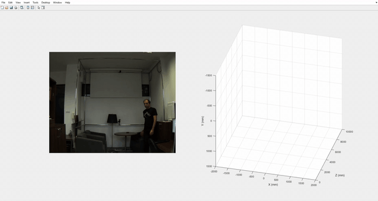
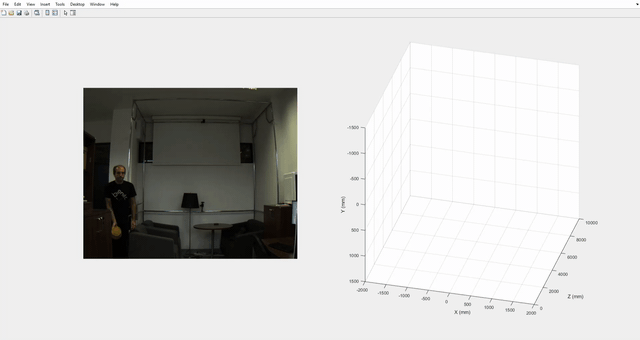

# Computer Vision
## Tutorial 2 - Image processing and segmentation
### Segmenting the ball and calculating the ball parameters (image) [3p]
One can use the function [findBall](./findBall.m) with Matlab's 
[Image Batch Processor](https://www.mathworks.com/help/images/batch-processing-using-the-image-batch-processor-app.html)
App in order to see how the image is segmented and the ball is detected.
Additionally, one can also find the ball region parameters (Image coordinates
and image radius).

### Calculating the ball parameters (world) [1p]
One can run the script [plot WorldCoordinates](./plotWorldCoordinates.m) that
will make use of the function [findBallWorld](./findBallWorld.m) in order to 
make a 3D scatter plot of the world coordinates calculated from the different 
folders that contain images.

### Trajectory estimation and prediction with results visualization [3p]
One can run the final script [tutorial_2](./tutorial_2.m) in order to visualize
the trajectory estimation with an animation of the images being loaded.
The results are animated using Matlab's build-in debug mode. Therefore in order
to load the next frame, it is necessary to press the button "continue" or its
key binding "F5". One can deactivate the debug mode by running 
`tutorial_2(false)`.

It is worth to say that the performance of the script is far from optimal.
There are a considerable number of suboptimal computations with the only 
objective of plotting clear visualizations. Nevertheless, particular attention
has been paid to the important estimations, like the 
[findBallWorld](./findBallWorld.m) and [world2image](./world2image.m) functions. This ones run more
optimized code.

#### Results animations

