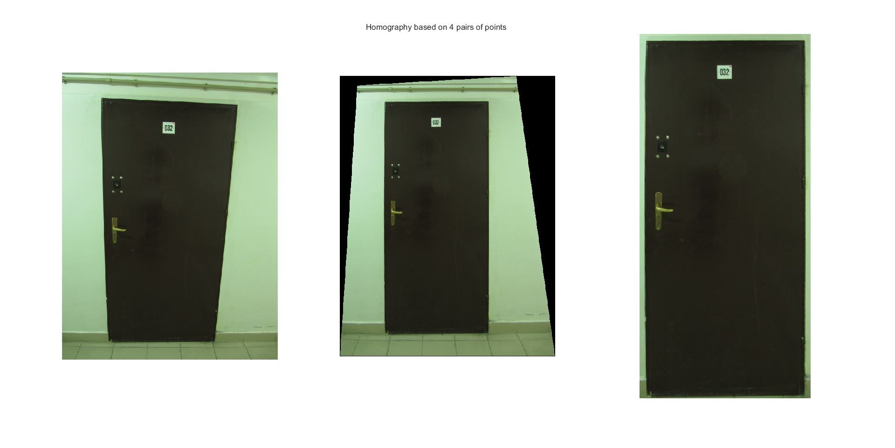
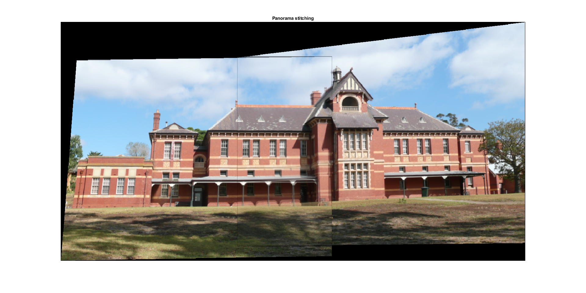

# T4 Homography

To test homography estimation in practice. for this task you will use
analytical solution for the 4 point matching

## Calculating the homography based on 4 pairs of points [3p]

*The clue of the task is homography calculation. Given the reference points
(selected on the input image by mouse) and size of the object in the output
image (or another set of four points) you have to create the linear system and
solve it to obtain matrix H.*

The homography is calculated using the function
[calculate_homography](./calculate_homography.m). An auxiliary
function has been built in order to ask the user to select 4 points. This
function is [get_trapezium](./get_trapezium.m) and it has the extra perk that
it always returns the points in the same order, making the order that the user
selects the points unimportant. On the following animation one can see that the
result is always the same no matter in which order the user has selected the
points.


## Warping and cropping the image [2p]

*For the calculated homography you have to warp the input image to get the
perspective corrected one.*

*After the warping you should crop the image to contain only the selected object
with a small (10px) border around.*

Using [tutorial_5_door](./tutorial_5_door.m) one can calculate the homography
and represent the input, warped and cropped images. The image is cropped using
the auxiliary function [crop_image](./crop_image.m). One can make use of the
`debug` function argument to skip the point selection part and use previously
selected points. The function can be called then like:
```
>> tutorial_5_door(true)
```



## Panorama stitching [2p]

*Using the homography calculation, you have to create a panorama image from two
photos. Select four points that correspond on both images and calculate
homography transforming both images to the perspective corrected view and merge
them.*

Using [tutorial_5_panorama_stitching](./tutorial_5_panorama_stitching.m) one
can calculate the homography and represent the fused panorama images. One can
make use of the `debug` function argument to skip the point selection part and
use previously selected points. The function can be called then like:
```
>> tutorial_5_panorama_stitching(true)
```

The point selection is essential. Changing a single pixel in the image points
can lead to very different results. Using a feature detection algorithm
together with the manual input selection would decrease the errors
significantly.  

