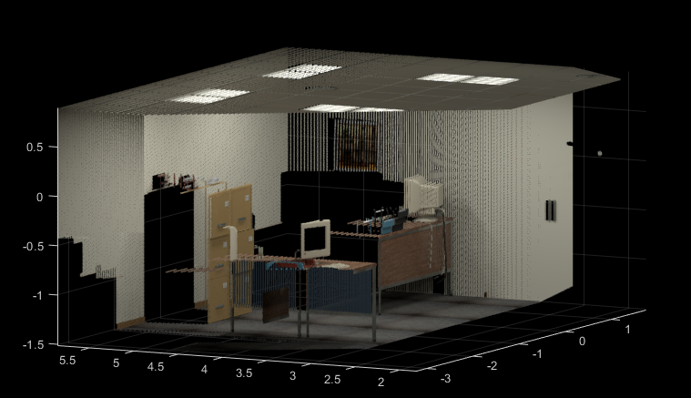
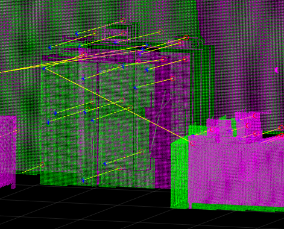
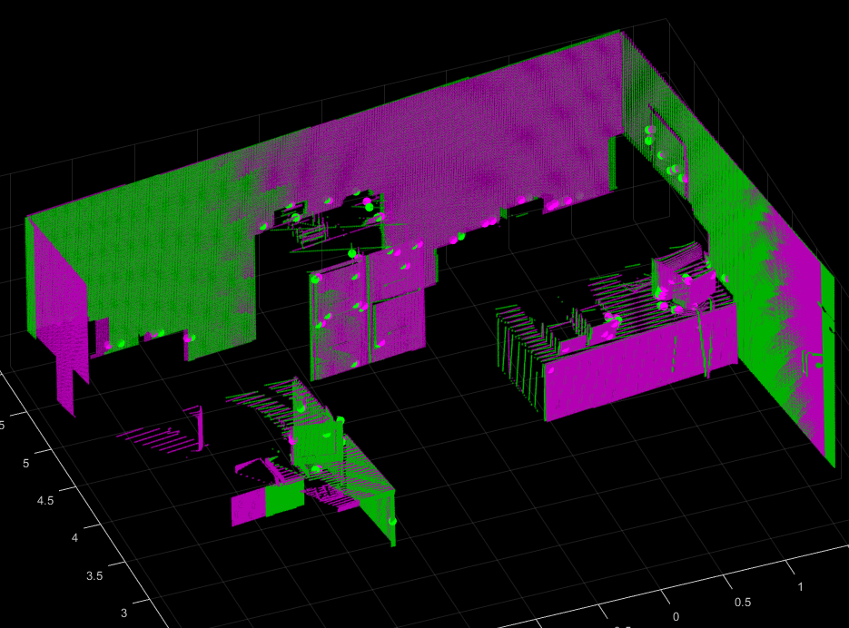
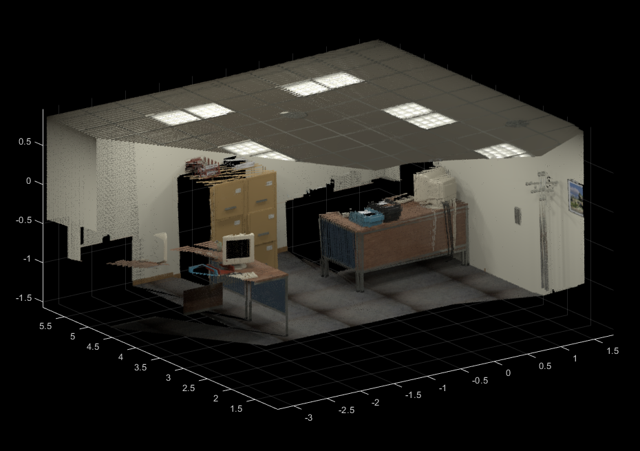
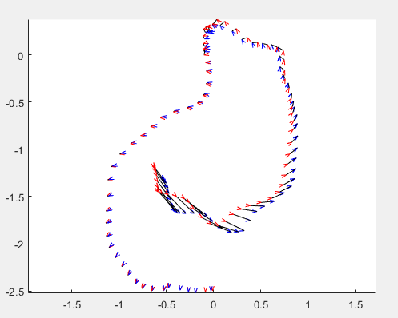

# T5 RGB-D registration

Your goal in this double-part exercise is to calculate camera trajectory having
a set of RGB images with depth information added.

## Part 1
Some test functions for each of the items have been developed and can be
executed with the suggested commands once matlab has the repository as the
working directory.

+ [Data loading and depth to pointcloud conversion](./reproject.m): 1 pt
```matlab
test('testReproject')
```


+ [3-point transformation estimation](./estimateTransform.m): 2 pts
```matlab
test('testEstimateTransform')
```

+ [RanSaC implementation](./ransacTransform.m): 2 pts
```matlab
test('testRansacTransform')
```

+ [Transformation estimation between the pairs of images](./prototype1.m): 2 pts
```matlab
prototype1
```



+ [Point cloud merge of several images](./prototype2.m)
```matlab
prototype2
```


+ [Trajectory estimation](./main.m)
```matlab
main
```

