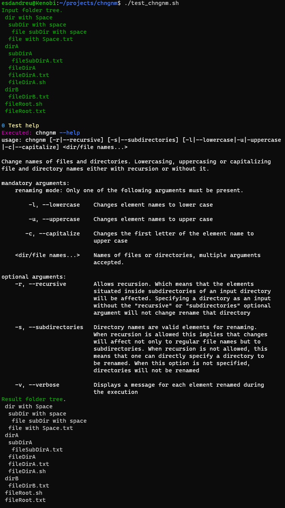
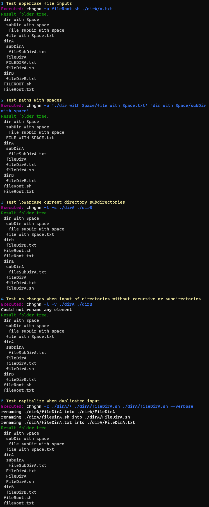
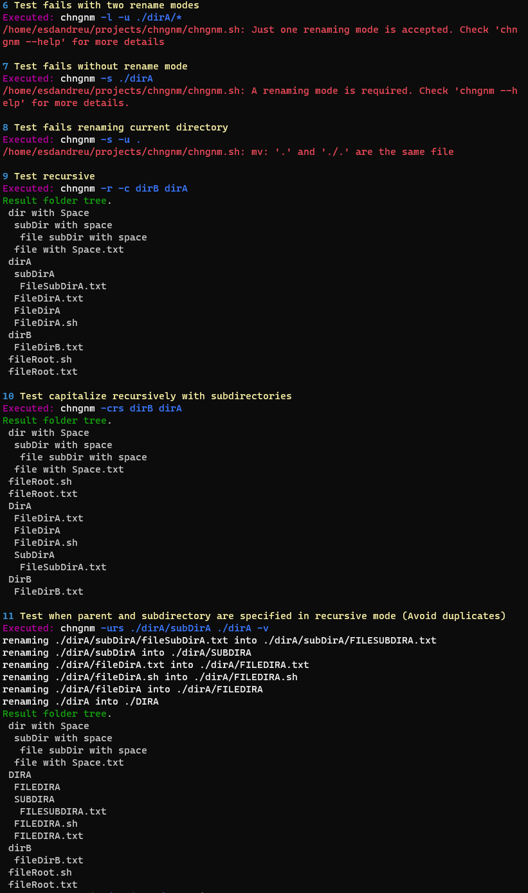

# chngnm
Andreu Gimenez Bolinches
## Task Description
### 1. Change name bash script

```
chngnm [-r|--recursive] [-s|--subdirectories] [-l|--lowercase|-u|-uppercase] <dir/file names...> 
chngnm [-h|--help]
```
The goal of the script is to change names of files. 
The script is dedicated to lowercasing (-l or --lowercase) file and directory 
names or uppercasing (-u or --uppercase) file and directory names given as 
arguments. Changes may be done either with recursion (for all the files in 
subdirectories '-r' or --recursive) or without it. 

In recursive mode changes may affect only regular file names or subdirectory 
names (if with '-s' or --subdirectories) as well. Option -s without -r allows 
modification of directory names in the current directory. Option -h 
(or --help) should print help message. 
 
### 2. Write additional script with chngnm examples
To demonstrate and to test chngnm working scenarios, also to test how the
script behaves when incorrect arguments to chngnm are given.
Examples of correct usage: 
```
chngnm -l File1 FILE2 
chngnm -u a* 
chngnm -r -u file1 dir1 dir2 dir3 
chngnm -r -s -u file1 file2 dir1 dir2
```

## Implementation

The change name bash script is defined in [chngnm.sh](./chngnm.sh). It features
the usage of wildcards for selecting files and correct behaviour when using
file and directory paths with blank spaces in it. 

A complete test suite has been developed in [test_chngnm.sh](./test_chngnm.sh).
It has been developed with the idea of modularity, allowing anybody to input
more tests easily. The current implementation has been successfully tested in
[git bash for Windows](https://gitforwindows.org/) and bash version
`5.0.17(1)-release` on ubuntu version `20.04.1 LTS`.

## Screenshots


