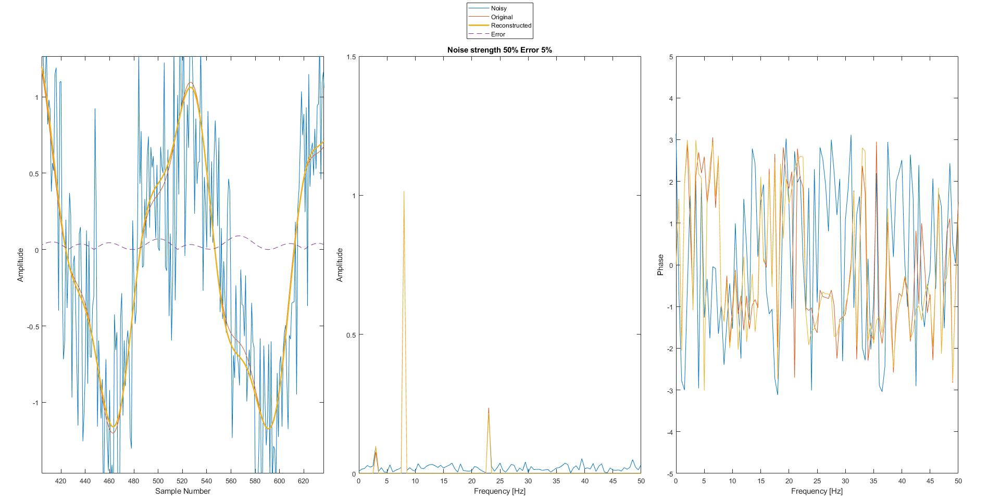
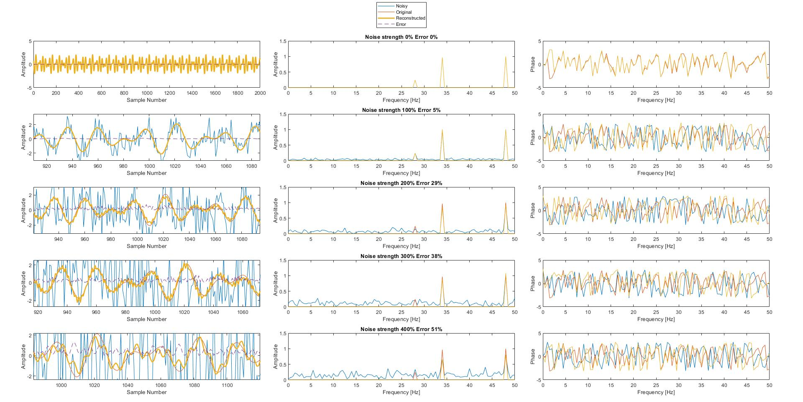

# T4 Fourier Transform

#### Create a new signal by adding random noise to a signal from the previous task (using randn for example). Analyse the noisy signal in the same way as the clean one. Find three dominant amplitudes and corresponding phase shifts and frequencies (using maxk or sort) and reconstruct the initial signal.

#### Show both signals (noisy and reconstructed) on the same plot. Compare the retrieved values (frequency, amplitude, and phase) with the original ones. Experiment with the noise strength - how big it must be to make the original signal unrecoverable?

The following figure shows the noisy, original and reconstructed signal in the
same plot. Additionally one can also see the error curve (absolute difference
between reconstructed and original signal).



From the experiments realized, a confident noise strength is 100%.
Being the noise_strength the percentage of the ratio between the noise
distribution area and the maximum amplitude component of the original signal.

As the original signal always has a component with amplitude 1,
the noise can be calculated in matlab using the following code:
```
noise = randn([1 L])*noise_strength/100; % L is the signal length
```

The following figure illustrates one of the experiments realized.
It is easy to observe that on noise strengths greater than 100% result in
a "noisy" reconstructed signal. This is due to the fact that a high frequency
and low amplitude component has been reconstructed from the induced noise.



Lastly, in this table one can find the retrieved component values compared
to the original ones:

                                     Amplitude                   Frequency                        Phase
                           _____________________________    ____________________    ________________________________

    Original                     1    0.96655    0.24246    48       34       28     0.29147      1.6445      2.1916
    Noise strength 0%            1    0.96655    0.24246    48       34       28     0.29147      1.6445      2.1916
    Noise strength 100%     1.0061    0.99182    0.23788    34       48       28      1.6256     0.34487      2.1555
    Noise strength 200%    0.91269    0.84541    0.27493    48       34    382.5     0.22121      1.6025      1.4393
    Noise strength 300%      1.079    0.88141     0.3811    48       34    444.5       0.297      1.9024     0.34657
    Noise strength 400%    0.80406    0.66006    0.51196    48       34      158    0.078963      1.7797     -0.4247

